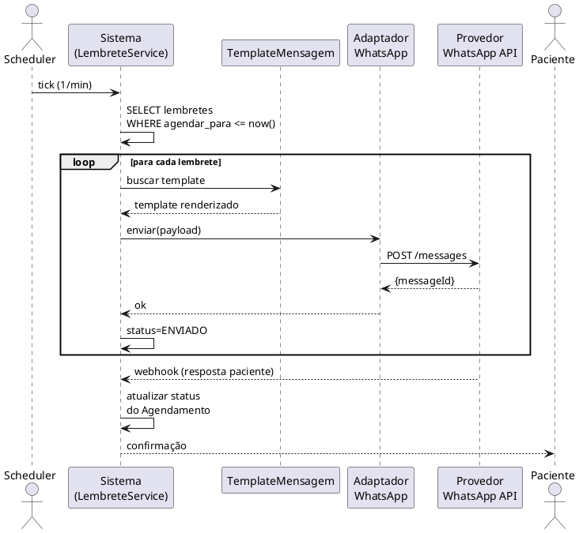

# UC04 — Enviar Lembrete (WhatsApp/E-mail)

**Autor:** Mateus Lucas Prado Amorim
**Referência:** Larman — *Utilizando UML e Padrões*, capítulo 6 (formato *fully dressed*)

---

## Identificação

| Campo | Valor |
|---|---|
| **ID** | UC04 |
| **Nome** | Enviar Lembrete (WhatsApp/E-mail) |
| **Escopo** | Sistema de Gestão para Clínica de Psicologia |
| **Nível** | Caso de uso de subfunção (disparado por scheduler do sistema) |
| **Ator Principal** | Sistema (agendador/scheduler **interno** de lembretes) |
| **Atores Secundários** | Provedor de WhatsApp Business API, Provedor de e-mail SMTP, Paciente (recebedor passivo / pode confirmar) |
| **Frequência** | Muito alta — proporcional ao volume de agendamentos |

> **Sobre o "agendador".** O *scheduler* é uma **rotina interna do próprio sistema** (não é um
> software externo): uma **classe ativa** que se aciona sozinha por tempo (ex.: a cada 1 min /
> toda manhã às 7h), varre os agendamentos do período e dispara os lembretes. É uma aplicação
> do padrão **Observer** — o agendador observa o relógio/eventos da agenda e reage quando a
> condição esperada ocorre, sem depender de uma chamada de outro objeto.

## Stakeholders e Interesses

| Stakeholder | Interesse |
|---|---|
| Paciente | Receber lembrete a tempo de organizar a agenda; poder confirmar/cancelar |
| Profissional | Reduzir no-show; ter agenda confirmada |
| Clínica | Reduzir perda de receita por falta; profissionalizar comunicação |
| Operadores (Carol/Karla) | Não precisar enviar lembrete manual via WhatsApp pessoal |

## Pré-condições

- PRE01 — Existe Agendamento com status AGENDADO ou CONFIRMADO.
- PRE02 — Paciente possui ao menos um canal preferido (WHATSAPP, EMAIL ou AMBOS).
- PRE03 — Clínica possui template de mensagem ativo para o tipo (LEMBRETE_24H, LEMBRETE_2H).
- PRE04 — Provedor de mensageria configurado e operacional.

## Pós-condições

- POS01 — Lembrete tem status atualizado para ENVIADO (sucesso) ou FALHADO (após 3 tentativas).
- POS02 — Caso de paciente confirme/cancele, status do agendamento é atualizado conforme.
- POS03 — Log de auditoria registra o envio.

---

## Cenário Principal de Sucesso

1. O **scheduler** roda a cada 1 minuto buscando lembretes com `agendar_para ≤ now() AND status IN (PENDENTE, REENVIO)`.
2. Para cada lembrete encontrado, o **sistema** seleciona o template apropriado (por clínica, tipo, canal) e renderiza com os dados do agendamento e do paciente (substituição de variáveis: `{{paciente}}`, `{{profissional}}`, `{{data}}`, `{{horario}}`, `{{modalidade}}`).
3. O **sistema** envia a mensagem via adaptador do canal (WhatsApp ou e-mail).
4. O **provedor externo** retorna confirmação de aceite.
5. O **sistema** atualiza `Lembrete.status = ENVIADO`, preenche `enviado_em` e incrementa `tentativas`.
6. O **sistema** registra log de auditoria.
7. O **sistema** aguarda eventual resposta do paciente (assíncrono).

## Extensões

### 1a. Nenhum lembrete pendente
1a1. Scheduler conclui sem ações.

### 2a. Paciente sem canal preferido
2a1. O **sistema** marca o lembrete como FALHADO_SEM_CANAL e notifica a Secretária no painel.

### 2b. Template ausente para o tipo/canal
2b1. O **sistema** registra erro de configuração e cria alerta para Admin.
2b2. Lembrete fica em status PENDENTE até template ser criado.

### 3a. Falha temporária do provedor (timeout, 5xx)
3a1. O **sistema** marca `status = REENVIO`, incrementa tentativas e re-agenda para 5 min depois.
3a2. Após 3 tentativas falhadas (RNF-RE-05), marca `status = FALHADO` e notifica Secretária.

### 3b. Mensagem rejeitada pelo provedor (paciente bloqueou, número inválido)
3b1. O **sistema** marca `status = FALHADO_REJEITADO` sem retry.
3b2. Notifica Secretária para atualizar canal do paciente.

### 5a. Canal "AMBOS" — envio duplicado
5a1. O **sistema** cria duas instâncias de Lembrete (uma WhatsApp + uma e-mail) na criação do agendamento.
5a2. Cada uma segue o fluxo independente.

---

## Cenário Alternativo — Paciente confirma o agendamento

1. **Paciente** recebe a mensagem e responde "1" (ou clica em link de confirmação).
2. O **provedor de WhatsApp** entrega o webhook ao sistema.
3. O **sistema** identifica o agendamento pela referência embutida e atualiza `Agendamento.status = CONFIRMADO`.
4. O **sistema** registra resposta no `Lembrete.resposta` e `Lembrete.status = CONFIRMADO`.
5. O **sistema** envia mensagem de "Confirmação recebida".

## Cenário Alternativo — Paciente cancela

1. **Paciente** responde "2" ou "CANCELAR".
2. O **sistema** verifica RN03 (antecedência mínima de cancelamento, ex.: 24h).
3. Se dentro do prazo: `Agendamento.status = CANCELADO`, slot liberado, profissional notificado.
4. Se fora do prazo: o sistema responde com mensagem de orientação (entrar em contato com a clínica) e mantém status.

---

## Requisitos especiais

- RE01 — Janela de envio: lembretes só são disparados entre 08:00 e 21:00 (configurável por clínica).
- RE02 — Idempotência: o mesmo Lembrete não pode ser enviado duas vezes (chave de idempotência por ID).
- RE03 — Reenvio com backoff: até 3 tentativas com intervalo de 5 min (RNF-RE-05).
- RE04 — Templates devem suportar variáveis e ser previsualizáveis.
- RE05 — Webhook de resposta deve verificar assinatura HMAC do provedor (segurança).
- RE06 — Em caso de revogação de consentimento LGPD, o paciente deixa de receber lembretes imediatamente.
- RE07 — Logs de envio são retidos por 12 meses.

## Lista de tecnologia e variações de dados

- Canais: { WHATSAPP, EMAIL }.
- Tipos de lembrete: { LEMBRETE_24H, LEMBRETE_2H, LEMBRETE_PERSONALIZADO, COBRANCA, CONFIRMACAO }.
- Status do lembrete: { PENDENTE, ENVIADO, CONFIRMADO, FALHADO, FALHADO_REJEITADO, FALHADO_SEM_CANAL, REENVIO }.
- Provedor WhatsApp: pluggable (Twilio, Z-API, Meta direta) via interface `WhatsAppGateway`.
- Provedor e-mail: SMTP padrão.
- Variáveis de template (mín.): `{{paciente}}, {{profissional}}, {{data}}, {{horario}}, {{modalidade}}, {{link_confirmacao}}, {{link_cancelamento}}`.

## Frequência de ocorrência

- Estimativa: 2 lembretes por agendamento × 150 agendamentos/dia = 300 envios/dia em clínica de 15 profissionais.
- Pico: 18h-20h do dia anterior (lembretes 24h) e 1h-2h antes do horário comercial (lembretes 2h).

## Regras de Negócio

- **RN01** — Lembretes só são enviados para Agendamentos com status AGENDADO ou CONFIRMADO.
- **RN02** — Lembretes não são enviados para agendamentos cancelados (cancelar deve cancelar lembretes pendentes).
- **RN03** — Cancelamento via lembrete só vale se respeitar a antecedência mínima (configurável por clínica, default 24h).
- **RN04** — Após 3 tentativas falhadas, o sistema desiste e notifica a Secretária para envio manual.
- **RN05** — Paciente com consentimento LGPD revogado não recebe lembretes (suspende silenciosamente).
- **RN06** — Templates seguem regras do WhatsApp Business (categoria UTILITY, aprovação prévia para mensagens fora da janela de 24h).

## Questões em aberto

- Q01 — A clínica deseja lembretes adicionais (3h antes, dia anterior à noite)?
- Q02 — Para mensagens fora da janela de 24h do WhatsApp, exigir template aprovado pela Meta — quem mantém esses templates?
- Q03 — Suporte a múltiplos idiomas (pt-BR, es-LATAM) está no escopo?

## Rastreabilidade

- Atende RFs: RF11, RF12, RF13, RF14.
- Atende necessidades: N03 (Lembretes automáticos).
- Atende RNFs: RNF-RE-05 (reenvio), RNF-CO-03 (intercambialidade de provedor), RNF-SE-08 (rate limit).
- Telas relacionadas: `Tela_Configuracao_Lembrete`, `Tela_Templates`, `Tela_Notificacoes`.
- Entidades envolvidas: Lembrete, Agendamento, TemplateMensagem, Paciente, ConsentimentoLGPD, LogAuditoria.

---

## Diagrama de sequência (PlantUML)

